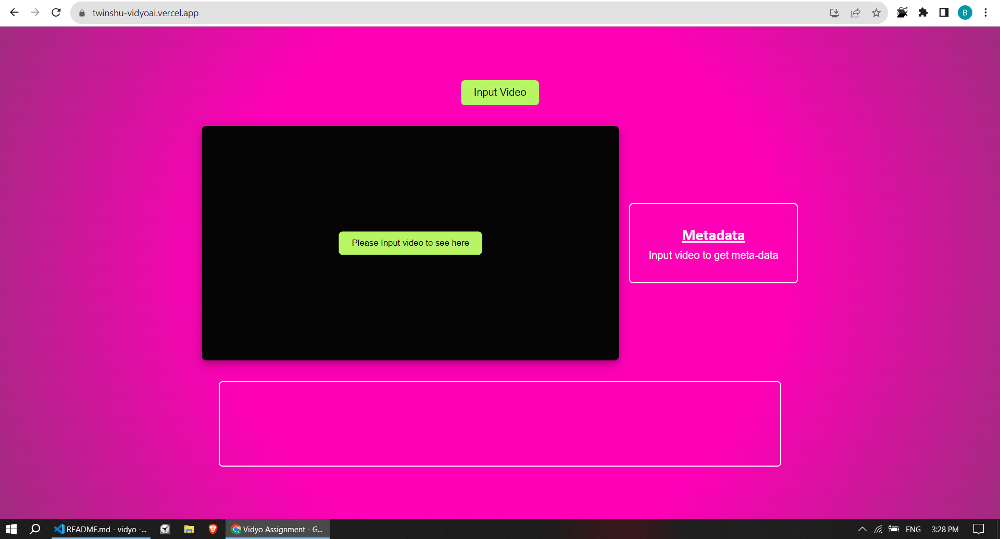
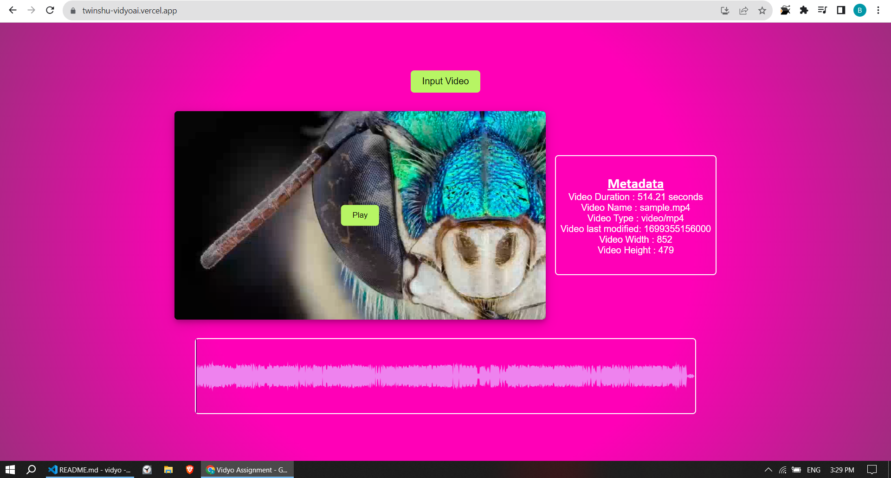

# Frontend Internship Assignment Documentation

## Video Player with ReactJS and HTML5 Canvas

### Overview

This repository contains a ReactJS-based Video Player that utilizes HTML5 Canvas for rendering video and audio features. The assignment is divided into two parts, each focusing on different functionalities.


### Part 1: Video Player Implementation

1. **Take video file as an input:**
   - Users can input a video file through the provided UI.

2. **Display video metadata:**
   - Display video metadata, including duration, on the user interface.

3. **Display video on the screen:**
   - Render the selected video on the screen using the HTML5 Canvas element.

4. **Play/Pause functionality:**
   - Implement a play/pause button in the middle of the video container.
   - The video should play or pause on clicking the button.

### Part 2: Audio Detection and Waveform Display

1. **Detect audio presence:**
   - Ensure the uploaded video has audio before allowing the upload.

2. **Display audio waveform:**
   - If audio is present, display the waveform in a box below the video.
   - Used wavesurfer.js options and events inorder to play it with sync of video. 


### Implementation Notes
- Host the code on a platform like Vercel: https://twinshu-vidyoai.vercel.app/

### My Implementation
----------------------------------------------



### Getting Started

1. Clone the repository:

   ```bash
   git clone https://github.com/your-username/frontend-internship-assignment.git
   ```

2. Navigate to the project directory:

   ```bash
   cd frontend-internship-assignment
   ```

3. Install dependencies:

   ```bash
   npm install
   ```

4. Run the development server:

   ```bash
   npm start
   ```
